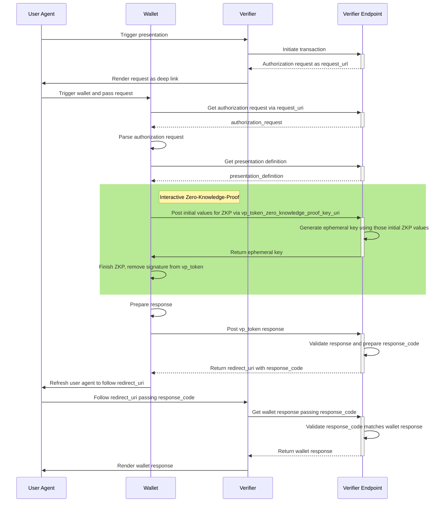

# OpenID4VP with Zero-Knowledge-Proof

## Description

### 1. Authorization Request

Additional data must be added to the  `client_metadata` in the `presentation_definition` (see [OpenID4VP section 9](https://openid.github.io/OpenID4VP/openid-4-verifiable-presentations-wg-draft.html#section-9)).

* Add claim `vp_token_zkp_key_uri` pointing to the endpoint for generating ephemeral key(s) used for interactive zero knowledge proof(s) (see section 2)
    * This mechanism is similar to the exchange of the `JWKS` key for response encryption (see [OpenID4VP section 6.3.](https://openid.github.io/OpenID4VP/openid-4-verifiable-presentations-wg-draft.html#section-6.3-11)) in the response mode "direct_post.jwt".
* Add possible zero-knowledge proof formats into `vp_formats`

    * `vc+sd-jwt+zkp` for a SD-JWT-like representation (based on `vc+sd-jwt` format identifier for SD-JWT)
    * `mso_mdoc+zkp` for a mdoc-like representation (based on `mso_mdoc` format identifier for Mdoc)
    * having a subkey `proof_type` containing possible curves and hash functions (e.g. using `secp256r1` and `sha256` leads to value `secp256r1-sha256` here)

* Specific format requirements may be specified for each `input_descriptor` element

    * this follows [section 5 from DIF Presentation Exchange 2.0.0](https://identity.foundation/presentation-exchange/spec/v2.0.0/#presentation-definition)

* Example:
  ```json
  {
    "presentation_definition": {
      "input_descriptors": [
        {
          "id": "eu.europa.ec.eudiw.pid.1",
          "format": { "vc+sd-jwt+zkp": { "proof_type": ["secp256r1-sha256"] } },
          [...]
        }
      ],
      "client_metadata": {
        "vp_token_zkp_key_uri": "https://verifier-example.dev/wallet/zkp/wDTYGoskVS9i3tijp6z0B0p/jwks.json",
        "vp_formats": {
          "vc+sd-jwt+zkp": {
            "proof_type": ["secp256r1-sha256"]
          },
          "mso_mdoc+zkp": {
            "proof_type": ["secp256r1-sha256"]
          }
        }
        [...]
      }
      [...] 
    },
    [...]
  }
  ```

### 2. Fetch ephemeral key (additional communication step)

* since the `presentation_definition` may contain multiple `input_descriptor`s, this endpoint returns a set of public keys, one for each descriptor, identified by `id`
* Method: `POST`
* URI:  `client_metadata.vp_token_zkp_key_uri` of Authorization Request (see section 1)
* Example request (`application/json`):
  ```json
  [
    {
      "id": "eu.europa.ec.eudiw.pid.1",
      "digest": "_4KGX6aVS8B0T6Hewpr1H9h9-gjkjOyu8A6fb85GE2w=",
      "r": "C7U9q9o7dkDEhcOYXO9yfckQYoRxYs8z6POaac6EBjM=",
      "proof_type": "secp256r1-sha256"
    }
  ]
  ```
    * `digest` being derived from the (payload inside)  `vp_token` using SHA-256
    * `r` being the first half of the signature from the `vp_token`

* Example response (`application/jwk-set+json`):
  ```json
  [
    {
      "id": "eu.europa.ec.eudiw.pid.1",
      "kid": "eu.europa.ec.eudiw.pid.1",
      "kty": "EC",
      "crv": "P-256",
      "x": "jjR25_Day4VGHGGSn0uW_dzS7dVO0at8xh8gZ8z992A",
      "y": "16LSQqNZzvs5BEIqsdnkWw127L0j3ThNbiMAN0BIQQY"
    }
  ]
  ```
    * those keys are ephemeral public keys derived from the input data (`digest` and `r`)
    * the EC key generation is non-standard but also on the `secp256r1` curve
    * each key is matched to the `input_descriptor` using the `id`

### 3. Response

* the response structure stays the same, according to [OpenID4VP section 6.1.](https://openid.github.io/OpenID4VP/openid-4-verifiable-presentations-wg-draft.html#section-6.1)
* inside the `descriptor_map` the used `format` is specified
    * possible formats:  `vc+sd-jwt+zkp`  and `mso_mdoc+zkp`  (see above at section 1)
* the tokens having a `...+zkp` format include parameters to finalize the zero-knowledge proof instead of the static signature from the issuer

## Sequence diagram

The sequence diagram is similar to the one without zero-knowledge proof. The green rectangle highlights the additional steps. (Base for the diagram is [in the Verifier Endpoint reference implementation](https://github.com/eu-digital-identity-wallet/eudi-srv-web-verifier-endpoint-23220-4-kt)).


